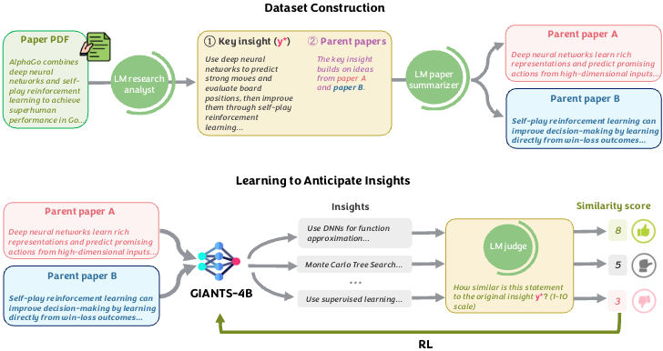

# Insight Anticipation

<p align="center">
  
</p>

<p align="center">
  <strong>Anonymous code release for literature-grounded scientific insight prediction.</strong>
</p>

Insight anticipation asks a model to predict a downstream paper's core contribution from the summaries of its two foundational parent papers. This repository contains the training and reward code used for our reinforcement-learning experiments, packaged as a clean, submission-ready release on top of the `verl` training stack.

## At a glance

| Component | Purpose | Entry point |
| --- | --- | --- |
| SFT | Bootstrap a policy on parent-summary to insight pairs | `scripts/train_sft.sh` |
| GRPO | Optimize the policy with similarity-based rewards | `scripts/grpo/train_grpo.sh` |
| Reward judge | Score generated insights against ground truth | `verl/utils/reward_score/insight_similarity/compute_score.py` |
| Core training stack | Distributed training and rollout infrastructure | `verl/` |

## End-to-end pipeline

The full reproduction path is four steps. Each step assumes you are in the repo root with the `insight-anticipation` conda env activated (see Step 1).

```
Step 1: Install environment
Step 2: Prepare SFT + RL data from Hugging Face
Step 3: Run SFT to get a bootstrapped policy
Step 4: Run GRPO from the SFT checkpoint
```

---

### Step 1 — Install the environment

Requires **Python 3.10** and **CUDA 12.4** (the pinned `torch==2.6.0` and `flashinfer` wheels are cu124-specific).

```bash
conda create -n insight-anticipation python=3.10 -y
conda activate insight-anticipation

pip install -r requirements.txt
pip install -e .
```

All package versions are pinned in [`requirements.txt`](requirements.txt) to match the env used for the paper. If `flash_attn` or `xformers` fail to build, install `torch==2.6.0` first, then re-run `pip install -r requirements.txt`.

---

### Step 2 — Prepare data

The public dataset lives at [`giants2026/GiantsBench-train`](https://huggingface.co/datasets/giants2026/GiantsBench-train). If it is gated, authenticate first with `huggingface-cli login` or `export HF_TOKEN=...`.

**SFT splits** (`query` / `completion` columns):

```bash
python scripts/prepare_sft_data.py \
    --dataset giants2026/GiantsBench-train \
    --output-dir data/insight_anticipation_sft
```

**GRPO splits** (verl RL schema: `prompt` / `reward_model.ground_truth` / `extra_info`):

```bash
python scripts/prepare_rl_data.py \
    --dataset giants2026/GiantsBench-train \
    --output-dir data/insight_anticipation_grpo \
    --drop-empty-insights
```

`prepare_rl_data.py` wraps each `query` into a single-turn chat prompt and extracts the `<insight>...</insight>` block from `completion` as `reward_model.ground_truth`. Both scripts auto-carve a deterministic 3% test split (seed 42) when the source has no `test` split; override via `--test-size` / `--seed` if needed.

You should end up with:

```text
data/
  insight_anticipation_sft/
    train.parquet
    test.parquet
  insight_anticipation_grpo/
    train.parquet
    test.parquet
```

See `verl/utils/dataset/README.md` for the base RL dataset contract.

---

### Step 3 — Run SFT

4-GPU SFT launcher:

```bash
BASE_MODEL=Qwen/Qwen3-4B \
TRAIN_DATA_DIR=$PWD/data/insight_anticipation_sft \
EVAL_DATA_DIR=$PWD/data/insight_anticipation_sft \
GPU_IDS=0,1,2,3 \
EXPERIMENT_NAME=qwen3-4b-sft \
TRAINER_DEFAULT_LOCAL_DIR=$PWD/outputs/sft \
bash scripts/train_sft.sh
```

Key knobs:

- `BASE_MODEL` — Hugging Face model ID or local checkpoint.
- `GPU_IDS` — Comma-separated GPU list.
- `TRAINER_DEFAULT_LOCAL_DIR` — Output directory for checkpoints and logs.
- `TRAINER_LOGGERS` — Hydra list string, e.g. `['console']` or `['console','wandb']`.

The resulting checkpoint path (under `TRAINER_DEFAULT_LOCAL_DIR/EXPERIMENT_NAME`) becomes the `BASE_MODEL` for Step 4.

---

### Step 4 — Run GRPO

Before launching, configure the reward judge (Gemini via API key **or** Vertex AI):

```bash
# Option A: Gemini API key
export GEMINI_API_KEY=...

# Option B: Vertex AI
export GOOGLE_CLOUD_PROJECT=your-project
export GOOGLE_APPLICATION_CREDENTIALS=/path/to/service-account.json
```

Then launch the 4-GPU GRPO run from the SFT checkpoint:

```bash
BASE_MODEL=$PWD/outputs/sft/qwen3-4b-sft \
TRAIN_DATA_DIR=$PWD/data/insight_anticipation_grpo \
EVAL_DATA_DIR=$PWD/data/insight_anticipation_grpo \
GPU_IDS=0,1,2,3 \
EXPERIMENT_NAME=qwen3-4b-grpo-similarity \
ROLLOUT_TP_SIZE=1 \
bash scripts/grpo/train_grpo.sh
```

Exposed hyperparameters:

- `MAX_PROMPT_LENGTH`, `MAX_MODEL_LEN`
- `ROLLOUT_N`, `ROLLOUT_TP_SIZE`
- `ACTOR_LR`, `TRAIN_BATCH_SIZE`, `TOTAL_TRAINING_STEPS`

Optional reward controls:

- `INSIGHT_SIMILARITY_MODEL` — defaults to `gemini-2.5-flash`.
- `INSIGHT_SIMILARITY_MAX_TOKENS` — defaults to `8192`.
- `INSIGHT_SIMILARITY_DEBUG_DIR` — writes prompt/response traces for debugging.

---

## Acknowledgments

This project builds on the `verl` reinforcement-learning stack. Upstream license and notices are preserved in this repository.
